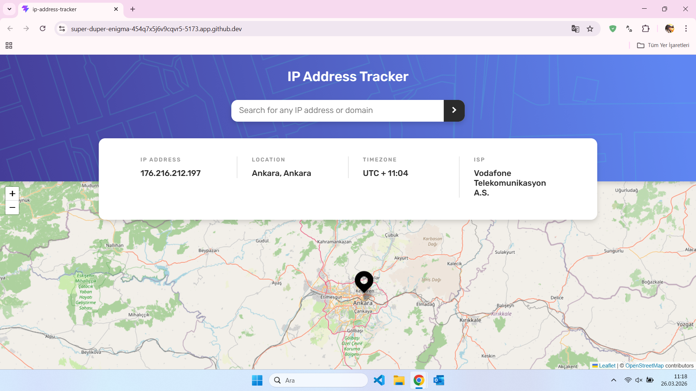
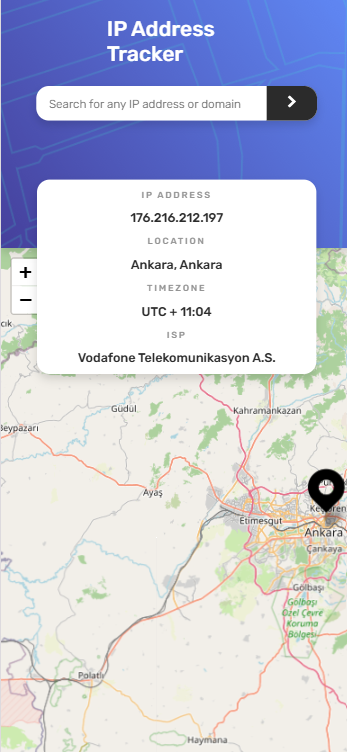

<!-- PROJECT HEADER -->
<h1 align="center">🗺️ IP Address Tracker 🗺️</h1>
<p align="center">
  <a href="https://www.frontendmentor.io/challenges/ip-address-tracker-I8-0yYAH0">
    
  </a>
</p>

## 📚 Table of Contents

- [Overview](#overview)
  - [The Challenge](#the-challenge)
  - [Screenshots](#screenshots)
  - [Links](#links)
- [My Process](#my-process)
  - [Built With](#built-with)
  - [What I Learned](#what-i-learned)
  - [Useful Resources](#useful-resources)
  - [AI Collaboration](#ai-collaboration)
- [Author](#author)
- [Acknowledgments](#acknowledgments)


## 📝 Overview

### 🎯 The Challenge

Users should be able to:
- ✅ View the optimal layout for each page depending on their device's screen size
- ✅ See hover states for all interactive elements on the page
- ✅ See their own IP address on the map on the initial page load
- ✅ Search for any IP addresses or domains and see the key information and location

### 🖼️ Screenshots

<p float="left" align="center">
  <!-- Desktop view screenshot -->
  

  <!-- Mobile view screenshot -->
  
</p>

- **Left:** Desktop view  
- **Right:** Mobile view

- **Solution URL**: [https://your-solution-url.com](https://your-solution-url.com)
- **Live Site URL**: [https://your-live-site-url.com](https://your-live-site-url.com) 
### 🏗 Built With

#### **Features & Approaches**
- Semantic HTML5 markup  
- CSS custom properties (variables)  
- Flexbox & CSS Grid layout  
- Mobile-first workflow  
- Advanced styling with SCSS  
- Modern CSS-in-JS with [Styled Components](https://styled-components.com/)

#### **JavaScript & Frameworks**
- [JavaScript](https://developer.mozilla.org/en-US/docs/Web/JavaScript)
- [React](https://reactjs.org/)
- [Next.js](https://nextjs.org/)
- [Node.js](https://nodejs.org/)

#### **Maps & API Integration**
- [Leaflet.js](https://leafletjs.com/)
- [ipify API](https://www.ipify.org/)


### 🚀 What I Learned

While working on this project, I gained hands-on experience and deeper understanding in several areas:

| Concept             | Experience Gained                                                  |
|---------------------|--------------------------------------------------------------------|
| **SCSS**            | How to write efficient and organized styles                        |
| **CSS Grid**        | Responsive and flexible layouts                                    |
| **min-width**       | Enhancing layout responsiveness                                    |
| **translateX**      | Positioning elements and smooth transitions                        |
| **z-index**         | Managing stacking order                                            |
| **overflow-wrap**   | Word breaking and overflow issues                                  |
| **Cursor Styling**  | Changing cursor styles for interactivity                           |
| **@media Queries**  | Responsive interface refinement                                    |
| **Leaflet.js**      | Interactive maps and API keys                                      |
| **APIs**            | Connecting and fetching data                                       |
| **Effective JS**    | Code maintainability and UI design                                 |

<details>
<summary>Example: CSS Grid Layout</summary>

```css
.container {
  display: grid;
  grid-template-columns: 1fr 1fr;
  min-width: 320px;
  overflow-wrap: break-word;
}
```
</details>

<details>
<summary>Example: @media Query</summary>

```css
@media (max-width: 600px) {
  .container {
    grid-template-columns: 1fr;
  }
}
```
</details>

> Working through these challenges helped reinforce my knowledge and skills in modern frontend development!

#### 🎯 Continued Development Goals
- Build more projects focused on mastering layout structures using CSS Grid and Flexbox.
- Practice creating complex and responsive layouts.
- Continue refining frontend best practices and UI component layout strategies.


### 📎 Useful Resources

- [Kısaca SCSS - Medium](https://medium.com/bursa-i-o/k%C4%B1saca-scss-f026566182cd)  
- [Leaflet.js Documentation](https://leafletjs.com/)  
- [GitHub Copilot](https://github.com/features/copilot)  
- [CSS Border & Outline Generator](https://html-css-js.com/css/generator/border-outline/)  


### 🤖 AI Collaboration

During this project, I made effective use of AI-powered tools to streamline development and planning:

- **GitHub Copilot**: Extensive use for code completion, boilerplate, and efficient solutions.
- **Blackbox AI**: Project planning, brainstorming, outlining features, and architectural alternatives.

> Both tools provided valuable suggestions, although I always reviewed and validated the code and plans they generated.


## 👩‍💻 Author

- Website – [Münevver Yıldırım](https://mnevveryild.github.io/my-web-site/)
- Frontend Mentor – [@mnevveryild](https://www.frontendmentor.io/profile/mnevveryild)
