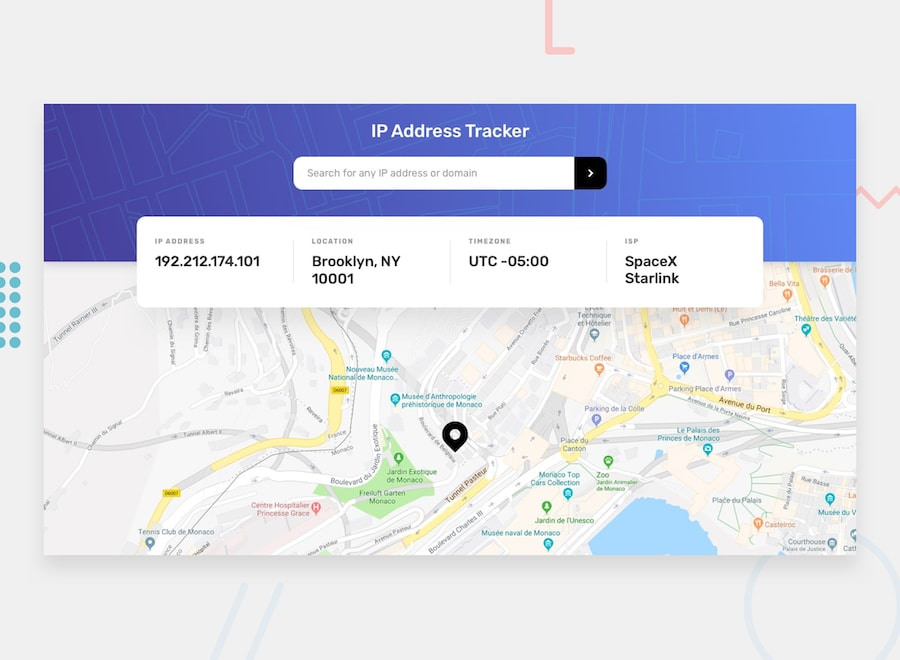

# Frontend Mentor - IP Address Tracker

---

## Welcome! 👋

Thanks for checking out this front-end coding challenge.

[Frontend Mentor](https://www.frontendmentor.io) challenges help you improve your coding skills by building realistic projects.

**To do this challenge, you need a basic understanding of HTML, CSS and JavaScript.**

---

## The Challenge

Your challenge is to build out this IP Address Tracker app and get it looking as close to the design as possible.  
To get the IP Address locations, you'll be using the [IP Geolocation API by IPify](https://www.ipify.org/).

You can use any tools you like to help you complete the challenge.  
So if you've got something you'd like to practice, feel free to give it a go.

### Your users should be able to:

- View the optimal layout for each page depending on their device's screen size
- See hover states for all interactive elements on the page
- See their own IP address on the map on the initial page load
- Search for any IP addresses or domains and see the key information and location

---

⚠️ **IMPORTANT** ⚠️  
To use the IP Geolocation API by IPify, you'll need to sign up for a free account.  
You won't need to add any card details to do this and it's a very quick process. This will give you an API Key.

For mapping, we recommend using [LeafletJS](https://leafletjs.com/).  
It's free to use and doesn't require an API Key. If you decide to use another API (like Google Maps or Mapbox), be sure to secure your API keys!

- [API Key best practices from Google Developers](https://developers.google.com/maps/api-key-best-practices)
- [How to use Mapbox securely](https://docs.mapbox.com/help/troubleshooting/how-to-use-mapbox-securely/)

> Exposing your API Key publicly can lead to other people using it for their own applications!  
> Please be sure you read the guides thoroughly and implement the necessary precautions.

**We don't take any responsibility if you expose your API Key while completing the challenge and have not secured it.**

---

Want some support on the challenge?  
[Join our community](https://www.frontendmentor.io/community) and ask questions in the **#help** channel.

---

## Where to find everything

Your task is to build out the project based on the designs inside the `/design` folder. You will find both a mobile and a desktop version.

- The designs are in JPG format.  
- Use your best judgment for `font-size`, `padding` and `margin`.
- For the Figma file, [subscribe as a PRO member](https://www.frontendmentor.io/pro).
- All assets are in the `/images` folder.
- There is also a `style-guide.md` file with palette and fonts info.

---

## Using AI coding assistants

We've included two files to help you if you're using AI coding assistants:

- `AGENTS.md` – Detailed instructions for AI assistants.
- `CLAUDE.md` – Claude-based pointer file.

**How to use them:** You don't need to do anything! They're auto-detected by most AI coding tools.

> **Note:** These files help you _learn_, not do the work for you. AI is instructed to ask, hint, and explain—not solve everything for you!

---

## Building your project

Feel free to use any workflow you like. Below is a suggested process (follow as much as you want):

1. Initialize your project as a public repository on [GitHub](https://github.com/)
2. Configure your repository to publish your code to a web address.
3. Review the designs and plan your CSS classes to create reusable styles.
4. Structure your content with HTML before adding any CSS.
5. Write out base styles (font-family, font-size, etc).
6. Add styles top to bottom, one section at a time.

---

## Deploying your project

**Recommended free hosts:**

- [GitHub Pages](https://pages.github.com/)
- [Vercel](https://vercel.com/)
- [Netlify](https://www.netlify.com/)

[More about recommended trusted hosts](https://medium.com/frontend-mentor/frontend-mentor-trusted-hosts-19b8f3bad8f)

---

## Create a custom `README.md`

Please overwrite this `README.md` with a custom one.

- We provided a template: [`README-template.md`](./README-template.md)
- Fill it out, then delete this file and rename the template to `README.md`.

_A good custom README helps you explain your project and reflect on your learnings!_

---

## Submitting your solution

Submit your solution on the platform to share with the community.  
[Complete guide to submitting solutions](https://medium.com/frontend-mentor/a-complete-guide-to-submitting-solutions-on-frontend-mentor-ac6384162248)

> If you want feedback, ask specific and detailed questions when submitting!

---

## Sharing your solution

Share your solution on:

1. The **#finished-projects** channel in the [community](https://www.frontendmentor.io/community)
2. Tweet [@frontendmentor](https://twitter.com/frontendmentor) with your repo/live URLs
3. LinkedIn, etc.
4. Blog about your experience

We provide sharing templates. Please edit them and ask specific feedback questions when sharing!

---

## Got feedback for us?

We love feedback!  
Please email hi@frontendmentor.io with anything you'd like to share.

This challenge is completely free—please share it with anyone who might find it useful.

**Have fun building! 🚀**

---

# ip-address-tracker
